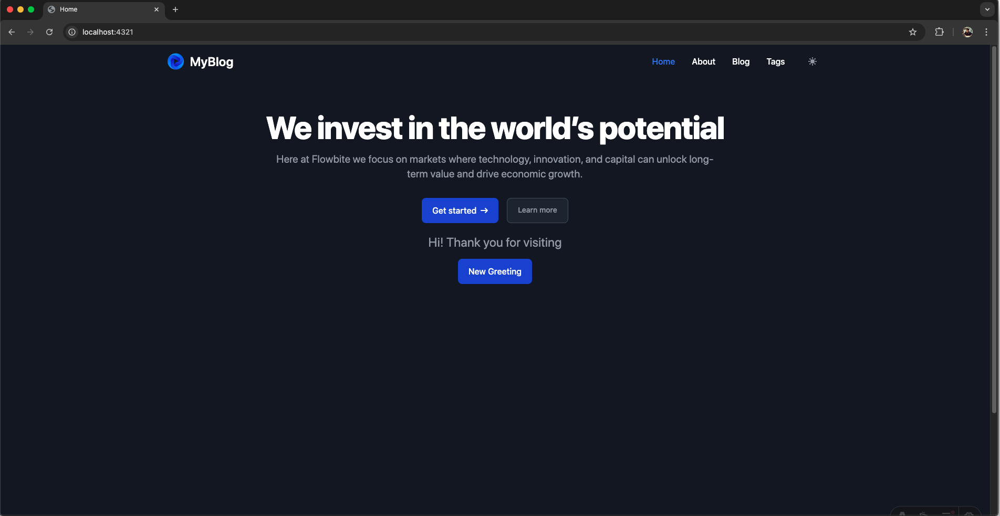

# ✨ Exploring Astro Framework ✨

After diving into Astro Framework, I was impressed by how it delivers a lightweight and fast performance. With its island architecture approach, Astro enables rendering only for the parts that are needed, making it incredibly efficient for building modern websites.

**💡 Key highlights of Astro:**

-   Built-in partial hydration, ensuring only critical components are loaded.
-   Support for various frontend frameworks like React, Vue, and Svelte.
-   Perfect for projects such as blogs, landing pages, or documentation.

Here’s a **blog application** I created by following the tutorial from Astro’s documentation. This experience showed me how easy it is to get started and achieve outstanding results with Astro! 🚀

Additionally, Astro’s growing ecosystem and seamless integration with CMS or external APIs make it a go-to solution for developing high-performance websites.

Have you tried Astro yet? Share your experience in the comments below! 😊

